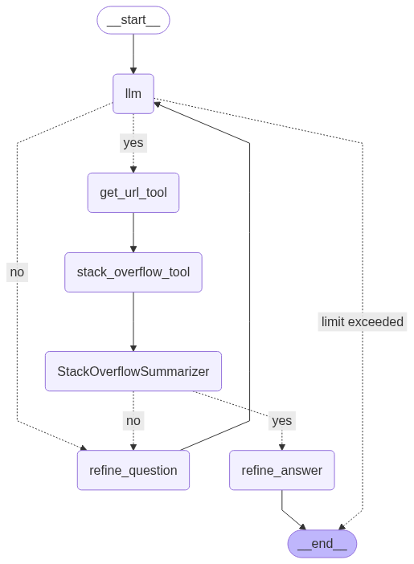

# Intelligent Stack Overflow Query Agent

---

**IMPORTANT NOTICE:**
This readme currently only contains discription about the agent in the folder `complex_sot`.

---

This project implements an intelligent agent framework designed to interactively query Stack Overflow for programming questions and retrieve refined answers. It uses a combination of large language models (LLMs) and external tools for search and summarization, orchestrated through a state machine graph architecture using LangGraph.

---

## Table of Contents
- [Overview](#overview)
- [Features](#features)
- [Architecture](#architecture)
- [Installation](#installation)
- [Usage](#usage)
- [Components](#components)
- [How It Works](#how-it-works)
- [LangGraph-Report](#LangGraph-report)

---

## Overview

This agent is built around a core LLM model bound to multiple tools that provide specialized functions such as fetching relevant URLs from Stack Overflow, extracting question and answer content, and summarizing responses.

Using a graph-based state machine (LangGraph), the agent dynamically switches between:

* **Querying the LLM**
* **Calling external tools**
* **Refining ambiguous or incomplete questions**
* **Refining and validating answers**

This design enables an iterative, multi-step approach to delivering accurate and relevant programming help.

---

## Features

* **Multi-tool integration**: Supports multiple external tools including URL retrieval and answer summarization.
* **State graph orchestration**: Uses LangGraph to define and compile a state machine workflow.
* **Iterative refinement**: Dynamically refines user queries and agent answers for improved quality.
* **Conditional branching**: Makes decisions based on tool responses to continue or stop the workflow.
* **Groq LLM support**: Uses the Groq-powered ChatGroq LLM backend for natural language understanding and generation.

---

## Architecture

The agent architecture is based on a directed graph representing states and transitions, with nodes representing:

* **LLM query processing** (`llm` node)
* **Tool invocations** (one node per tool)
* **Question refinement node** (`refine_question`)
* **Answer refinement node** (`refine_answer`)

Transitions depend on results, such as whether relevant Stack Overflow results are found or if answers need more refinement.

---

## Installation

1.  **Clone this repository**:

    ```bash
    git clone [https://github.com/yourusername/stack-overflow-agent.git](https://github.com/yourusername/stack-overflow-agent.git)
    cd stack-overflow-agent
    ```

2.  **Install required Python packages** (example):

    ```bash
    pip install -r requirements.txt
    ```

3.  **Set up environment variables** by creating a `.env` file in the root:

    ```ini
    GROQ_API_KEY=your_groq_api_key_here
    ```

    Ensure you have access to the Groq LLM and the required tools (`StackOverflow`, `get_urls`, and `summarizer` modules).

---

## Usage

Here is a simple usage example:

```python
from langchain_groq import ChatGroq
from your_agent_module import Agent, get_url_tool, Stack_overflow_tool, StackOverflowSummarizer
from langchain_core.messages import HumanMessage

model = ChatGroq(model="llama-3.3-70b-versatile")
agent = Agent(model, [get_url_tool, Stack_overflow_tool, StackOverflowSummarizer], system="You are a helpful assistant")

messages = HumanMessage(content="How to reverse a string in Python?")
for event in agent.graph.stream({"messages": messages}):
    print(event)
```

### Example Output:  
```python
{'llm': {'messages': [AIMessage(content='', additional_kwargs={'tool_calls': [{'id': 'call_q580', 'function': {'arguments': '{"query":"reverse string in Python"}', 'name': 'get_url_tool'}, 'type': 'function'}]}, response_metadata={'token_usage': {'completion_tokens': 18, 'prompt_tokens': 591, 'total_tokens': 609, 'completion_time': 0.091476303, 'prompt_time': 0.037600399, 'queue_time': 0.053348040000000006, 'total_time': 0.129076702}, 'model_name': 'llama-3.3-70b-versatile', 'system_fingerprint': 'fp_3f3b593e33', 'finish_reason': 'tool_calls', 'logprobs': None}, id='run-b79f1c66-b710-43ab-8927-fdca3975bca2-0', tool_calls=[{'name': 'get_url_tool', 'args': {'query': 'reverse string in Python'}, 'id': 'call_q580', 'type': 'tool_call'}], usage_metadata={'input_tokens': 591, 'output_tokens': 18, 'total_tokens': 609})]}}
Calling tool: get_url_tool
{'get_url_tool': {'messages': [ToolMessage(content="['[https://stackoverflow.com/questions/931092/how-do-i-reverse-a-string-in-python](https://stackoverflow.com/questions/931092/how-do-i-reverse-a-string-in-python)', '[https://stackoverflow.com/questions/53381080/reverse-string-python](https://stackoverflow.com/questions/53381080/reverse-string-python)', '[https://stackoverflow.com/questions/65429384/how-to-reverse-a-string-in-python](https://stackoverflow.com/questions/65429384/how-to-reverse-a-string-in-python)', '[https://stackoverflow.com/questions/75410298/reversing-a-string-including-the-first-letter-in-python](https://stackoverflow.com/questions/75410298/reversing-a-string-including-the-first-letter-in-python)', '[https://stackoverflow.com/questions/68493773/how-do-i-reverse-this-string-in-python](https://stackoverflow.com/questions/68493773/how-do-i-reverse-this-string-in-python)', '[https://stackoverflow.com/questions/71972556/how-to-slice-a-string-in-reverse-in-python](https://stackoverflow.com/questions/71972556/how-to-slice-a-string-in-reverse-in-python)', '[https://stackoverflow.com/questions/40572550/reversing-part-of-a-string-in-python](https://stackoverflow.com/questions/40572550/reversing-part-of-a-string-in-python)']", name='get_url_tool', id='2bbc0ba2-df2a-42dd-913f-c2c1f5e6b54e', tool_call_id='call_q580'), AIMessage(content='Triggering next tool: stack_overflow_tool', additional_kwargs={}, response_metadata={}, id='389ec798-bc6f-4c9a-9a56-d3b6063125a6', tool_calls=[{'name': 'stack_overflow_tool', 'args': {'urls': ['[https://stackoverflow.com/questions/931092/how-do-i-reverse-a-string-in-python](https://stackoverflow.com/questions/931092/how-do-i-reverse-a-string-in-python)', '[https://stackoverflow.com/questions/53381080/reverse-string-python](https://stackoverflow.com/questions/53381080/reverse-string-python)', '[https://stackoverflow.com/questions/65429384/how-to-reverse-a-string-in-python](https://stackoverflow.com/questions/65429384/how-to-reverse-a-string-in-python)', '[https://stackoverflow.com/questions/75410298/reversing-a-string-including-the-first-letter-in-python](https://stackoverflow.com/questions/75410298/reversing-a-string-including-the-first-letter-in-python)', '[https://stackoverflow.com/questions/68493773/how-do-i-reverse-this-string-in-python](https://stackoverflow.com/questions/68493773/how-do-i-reverse-this-string-in-python)', '[https://stackoverflow.com/questions/71972556/how-to-slice-a-string-in-reverse-in-python](https://stackoverflow.com/questions/71972556/how-to-slice-a-string-in-reverse-in-python)', '[https://stackoverflow.com/questions/40572550/reversing-part-of-a-string-in-python](https://stackoverflow.com/questions/40572550/reversing-part-of-a-string-in-python)']}, 'id': 'synthetic-stack_overflow_tool-call_q580', 'type': 'tool_call'}])]}}
Calling tool: stack_overflow_tool
{'stack_overflow_tool': {'messages': [ToolMessage(content='[{\'question\': \'How do I reverse a string in Python?\', \'answers\': [{\'Upvotes\': 3123, \'Body\': \'Using slicing:\\n>>> \\\'hello world\\\'[::-1]\\n\\\'dlrow olleh\\\'\\n\\n\\nSlice notation takes the form [start:stop:step]. In this case, we omit the start and stop positions since we want the whole string. We also use step = -1, which means, "repeatedly step from right to left by 1 character".\\n\', \'Link\': \'[https://stackoverflow.com/a/931095](https://stackoverflow.com/a/931095)\'}, {\'Upvotes\': 323, \'Body\': "\\nWhat is the best way of implementing a reverse function for strings?\\n\\nMy own experience with this question is academic. However, if you\'re a pro looking for the quick answer, use a slice that steps by -1:\\n>>> \'a string\'[::-1]\\n\'gnirts a\'\\n\\nor more readably (but slower due to the method name lookups a...", \'Link\': \'[https://stackoverflow.com/a/27843760](https://stackoverflow.com/a/27843760)\'}, {\'Upvotes\': 309, \'Body\': "@Paolo\'s s[::-1] is fastest; a slower approach (maybe more readable, but that\'s debatable) is \'\'.join(reversed(s)).\\n", \'Link\': \'[https://stackoverflow.com/a/931099](https://stackoverflow.com/a/931099)\'}, {\'Upvotes\': 72, \'Body\': "This answer is a bit longer and contains 3 sections: Benchmarks of existing solutions, why most solutions here are wrong, my solution.\\nThe existing answers are only correct if Unicode Modifiers / grapheme clusters are ignored. I\'ll deal with that later, but first have a look at the speed of some rev...", \'Link\': \'[https://stackoverflow.com/a/56282726](https://stackoverflow.com/a/56282726)\'}]}, {\'question\': \'Reverse string Python\', \'answers\': [{\'Upvotes\': 4, \'Body\': \'You must first obtain the substring and then reverse it:\\ns = "hello"\\nfor i in range(len(s)-1, -1, -1):\\n    print(s[i:][::-1])\\n\\nOr:\\ns = "hello"\\nfor i, _ in enumerate(s):\\n    print(s[i:][::-1])\\n\\nOr reverse the word and get the substring:\\ns = "hello"\\nfor i, _ in enumerate(s):\\n    print(s[::-1][:i+1])\\n\\n\', \'Link\': \'[https://stackoverflow.com/a/53381133](https://stackoverflow.com/a/53381133)\'}, {\'Upvotes\': 2, \'Body\': "Easiest perhaps is to iterate from -1 backwards:\\ns = \'hello\'\\nfor i in range(1, len(s)+1):\\n    print(s[-1: -i-1: -1])\\n\\nhello\\no\\nol\\noll\\nolle\\nolleh\\n\\nThe way this works, you are slicing sequentially:\\n\\ns[-1: -2: -1],\ns[-1: -3: -1],...\\ns[-1: -len(s)-1: -1]\\n\\n", \'Link\': \'[https://stackoverflow.com/a/53381200](https://stackoverflow.com/a/53381200)\'}, {\'Upvotes\': 2, \'Body\': "To get the full string reversed you must use s[::-1] omitting the first value.\\nSince that doesn\'t fit into your iteration you\'ll have to use something like:\\ns = input()\\n\\nfor i in range(len(s) - 2, -1, -1):\\n  print(s[:i:-1])\\n\\nprint(s[::-1])\\n\\n", \'Link\': \'[https://stackoverflow.com/a/53381253](https://stackoverflow.com/a/53381253)\'}, {\'Upvotes\': 0, \'Body\': \'I would do it this way: \\na = "Hello"\\nfor i in range(len(a)):\\n    print(a[-i-1])\\n\\nThis way you are not dealing with string slices, only indexing the string and there isn\\\'t a bunch of extra numbers to figure out what they are doing. \\n\', \'Link\': \'[https://stackoverflow.com/a/53381337](https://stackoverflow.com/a/53381337)\'}]}, {\'question\': \'How to reverse a string in python?\', \'answers\': [{\'Upvotes\': 0, \'Body\': \'To reverse a string use the slice capability like:\\np_phrase = "was it a car or a cat I saw"\\nprint(p_phrase[::-1]  \\n\\nYields:\\n\\\'was I tac a ro rac a ti saw\\\'\\n\\n\', \'Link\': \'[https://stackoverflow.com/a/65431047](https://stackoverflow.com/a/65431047)\'}]}, {\'question\': \'Reversing a string including the first letter in python\', \'answers\': [{\'Upvotes\': 1, \'Body\': "The code you tried doesn\'t work because the slice a[3:0:-1] starts at index 3 and goes all the way to index 0 (in reverse), but it includes index 0, which is the first letter of the string.\\nThe slice a[3:-1:-1] starts at index 3 and goes to the index before the last one (-1), but in reverse. This wo...", \'Link\': \'[https://stackoverflow.com/a/75410334](https://stackoverflow.com/a/75410334)\'}]}, {\'question\': \'How do I reverse this string in python?\', \'answers\': [{'Upvotes\': 1, \'Body\': \'You can do like this:\\ndef string_reverse(string_value):\\n    return string_value[::-1]\\n\\nmy_string = "This is my string"\\nprint(string_reverse(my_string))\\n\\nor you can simply do it this way:\\nmy_string = "This is my string"\\nprint(my_string[::-1])\\n\\n\', \'Link\': \'[https://stackoverflow.com/a/68493804](https://stackoverflow.com/a/68493804)\'}]}, {\'question\': \'How to slice a string in reverse in Python?\', \'answers\': [{'Upvotes\': 2, \'Body\': \'You would split the string and then reverse it part you desire\\nrev = message.split()[-1][::-1]\\n\\nThis solution will also work for the example given in the OP (credit to Kelly Bundy):\\nrev = message[:-6:-1]\\n\\n\', \'Link\': \'[https://stackoverflow.com/a/71972586](https://stackoverflow.com/a/71972586)\'}, {\'Upvotes\': 1, \'Body\': \'For your specific question, you can use this:\\nmessage.split()[-1][::-1]\\n\n\', \'Link\': \'[https://stackoverflow.com/a/71972620](https://stackoverflow.com/a/71972620)\'}, {\'Upvotes\': 1, \'Body\': \'You just need to select the second slice with [1] and then reverse it using [::-1]\\nmessage.split()[1][::-1]\\n\', \'Link\': \'[https://stackoverflow.com/a/71972670](https://stackoverflow.com/a/71972670)\'}, {\'Upvotes\': 0, \'Body\': \'Python slices have three parts: a start, an end, and a step. A slice takes this form:\\nexample_slice = iterable[start:end:step]\\n\\nTo make your slice operate in reverse, make the step negative, swap the start and end, and decrement both.\\nmessage="hi there programmers"\\n\\nsliced_msg = message[3:8]\\nprint(s...\', \'Link\': \'[https://stackoverflow.com/a/78868687](https://stackoverflow.com/a/78868687)\'}]}, {\'question\': \'Reversing part of a string in Python\', \'answers\': [{'Upvotes\': 3, \'Body\': ">>> a = \'Python\'\\n>>> a[2:4]\\n\'th\'\\n\\nReverse the substring using [::-1]\\n>>> a[2:4][::-1]\\n\'ht\'\\n\\nor adjust indexes:\\n>>> a[3:1:-1]\\n\'ht\'\\n\\n", \'Link\': \'[https://stackoverflow.com/a/40572581](https://stackoverflow.com/a/40572581)\'}, {'Upvotes\': 2, \'Body\': "You have to swap the start and end offsets. Did you try a[3:1:-1]? Of course, you have to follow the usual way: initial offset is taken while the end offset isn\'t (this is why I changed 4 to 3 and 2 to 1).\\n", \'Link\': \'[https://stackoverflow.com/a/40572564](https://stackoverflow.com/a/40572564)\'}]}]', name='stack_overflow_tool', id='0036a4ca-a425-4525-9568-bb2c53506387', tool_call_id='synthetic-stack_overflow_tool-call_q580'), AIMessage(content='Triggering next tool: StackOverflowSummarizer', additional_kwargs={}, response_metadata={}, id='22e59acd-4ca1-4afb-a499-cf6d0e58ffb1', tool_calls=[{'name': 'StackOverflowSummarizer', 'args': {'query': 'How to reverse a string in Python?', 'stackoverflow_data': [{'question': 'How do I reverse a string in Python?', 'answers': [{'Upvotes': 3123, 'Body': 'Using slicing:\n>>> \'hello world\'[::-1]\n\'dlrow olleh\'\n\n\nSlice notation takes the form [start:stop:step]. In this case, we omit the start and stop positions since we want the whole string. We also use step = -1, which means, "repeatedly step from right to left by 1 character".\n', 'Link': '[https://stackoverflow.com/a/931095](https://stackoverflow.com/a/931095)'}, {'Upvotes': 323, 'Body': "\nWhat is the best way of implementing a reverse function for strings?\n\nMy own experience with this question is academic. However, if you're a pro looking for the quick answer, use a slice that steps by -1:\n>>> 'a string'[::-1]\n'gnirts a'\n\nor more readably (but slower due to the method name lookups a...", 'Link': '[https://stackoverflow.com/a/27843760](https://stackoverflow.com/a/27843760)'}, {'Upvotes': 309, 'Body': "@Paolo's s[::-1] is fastest; a slower approach (maybe more readable, but that's debatable) is ''.join(reversed(s)).\n", 'Link': '[https://stackoverflow.com/a/931099](https://stackoverflow.com/a/931099)'}, {'Upvotes': 72, 'Body': "This answer is a bit longer and contains 3 sections: Benchmarks of existing solutions, why most solutions here are wrong, my solution.\nThe existing answers are only correct if Unicode Modifiers / grapheme clusters are ignored. I'll deal with that later, but first have a look at the speed of some rev...", 'Link': '[https://stackoverflow.com/a/56282726](https://stackoverflow.com/a/56282726)'}]}, {'question': 'Reverse string Python', 'answers': [{'Upvotes': 4, 'Body': 'You must first obtain the substring and then reverse it:\ns = "hello"\nfor i in range(len(s)-1, -1, -1):\n    print(s[i:][::-1])\n\nOr:\ns = "hello"\nfor i, _ in enumerate(s):\n    print(s[i:][::-1])\n\nOr reverse the word and get the substring:\ns = "hello"\nfor i, _ in enumerate(s):\n    print(s[::-1][:i+1])\n\n', 'Link': '[https://stackoverflow.com/a/53381133](https://stackoverflow.com/a/53381133)'}, {'Upvotes': 2, 'Body': "Easiest perhaps is to iterate from -1 backwards:\ns = 'hello'\nfor i in range(1, len(s)+1):\n    print(s[-1: -i-1: -1])\n\nhello\no\nol\noll\nolle\nolleh\n\nThe way this works, you are slicing sequentially:\n\ns[-1: -2: -1],\ns[-1: -3: -1],...\ns[-1: -len(s)-1: -1]\n\n", 'Link': '[https://stackoverflow.com/a/53381200](https://stackoverflow.com/a/53381200)'}, {'Upvotes': 2, 'Body': "To get the full string reversed you must use s[::-1] omitting the first value.\nSince that doesn't fit into your iteration you'll have to use something like:\ns = input()\n\nfor i in range(len(s) - 2, -1, -1):\n  print(s[:i:-1])\n\nprint(s[::-1])\n\n", 'Link': '[https://stackoverflow.com/a/53381253](https://stackoverflow.com/a/53381253)'}, {'Upvotes': 0, 'Body': 'I would do it this way: \na = "Hello"\nfor i in range(len(a)):\n    print(a[-i-1])\n\nThis way you are not dealing with string slices, only indexing the string and there isn\'t a bunch of extra numbers to figure out what they are doing. \n', 'Link': '[https://stackoverflow.com/a/53381337](https://stackoverflow.com/a/53381337)'}]}, {'question': 'How to reverse a string in python?', 'answers': [{'Upvotes': 0, 'Body': 'To reverse a string use the slice capability like:\np_phrase = "was it a car or a cat I saw"\nprint(p_phrase[::-1]  \n\nYields:\n\'was I tac a ro rac a ti saw\'\n\n', 'Link': '[https://stackoverflow.com/a/65431047](https://stackoverflow.com/a/65431047)'}]}, {'question': 'Reversing a string including the first letter in python', 'answers': [{'Upvotes': 1, 'Body': "The code you tried doesn't work because the slice a[3:0:-1] starts at index 3 and goes all the way to index 0 (in reverse), but it includes index 0, which is the first letter of the string.\nThe slice a[3:-1:-1] starts at index 3 and goes to the index before the last one (-1), but in reverse. This wo...", 'Link': '[https://stackoverflow.com/a/75410334](https://stackoverflow.com/a/75410334)'}]}, {'question': 'How do I reverse this string in python?', 'answers': [{'Upvotes': 1, 'Body': 'You can do like this:\ndef string_reverse(string_value):\n    return string_value[::-1]\n\nmy_string = "This is my string"\nprint(string_reverse(my_string))\n\nor you can simply do it this way:\nmy_string = "This is my string"\nprint(my_string[::-1])\n\n', 'Link': '[https://stackoverflow.com/a/68493804](https://stackoverflow.com/a/68493804)'}]}, {'question': 'How to slice a string in reverse in Python?', 'answers': [{'Upvotes': 2, 'Body': 'You would split the string and then reverse it part you desire\nrev = message.split()[-1][::-1]\n\nThis solution will also work for the example given in the OP (credit to Kelly Bundy):\nrev = message[:-6:-1]\n\n', 'Link': '[https://stackoverflow.com/a/71972586](https://stackoverflow.com/a/71972586)'}, {'Upvotes': 1, 'Body': 'For your specific question, you can use this:\nmessage.split()[-1][::-1]\n\n', 'Link': '[https://stackoverflow.com/a/71972620](https://stackoverflow.com/a/71972620)'}, {'Upvotes': 1, 'Body': 'You just need to select the second slice with [1] and then reverse it using [::-1]\nmessage.split()[1][::-1]\n', 'Link': '[https://stackoverflow.com/a/71972670](https://stackoverflow.com/a/71972670)'}, {'Upvotes': 0, 'Body': 'Python slices have three parts: a start, an end, and a step. A slice takes this form:\nexample_slice = iterable[start:end:step]\n\nTo make your slice operate in reverse, make the step negative, swap the start and end, and decrement both.\nmessage="hi there programmers"\n\nsliced_msg = message[3:8]\nprint(s...', 'Link': '[https://stackoverflow.com/a/78868687](https://stackoverflow.com/a/78868687)'}]}, {'question': 'Reversing part of a string in Python', 'answers': [{'Upvotes': 3, 'Body': ">>> a = 'Python'\n>>> a[2:4]\n'th'\n\nReverse the substring using [::-1]\n>>> a[2:4][::-1]\n'ht'\n\nor adjust indexes:\n>>> a[3:1:-1]\\n'ht'\n\n", 'Link': '[https://stackoverflow.com/a/40572581](https://stackoverflow.com/a/40572581)'}, {'Upvotes': 2, 'Body': "You have to swap the start and end offsets. Did you try a[3:1:-1]? Of course, you have to follow the usual way: initial offset is taken while the end offset isn\'t (this is why I changed 4 to 3 and 2 to 1).\\n", 'Link': '[https://stackoverflow.com/a/40572564](https://stackoverflow.com/a/40572564)'}]}]}, 'id': 'synthetic-StackOverflowSummarizer-synthetic-stack_overflow_tool-call_q580', 'type': 'tool_call'}])]}}
Calling tool: StackOverflowSummarizer
{'StackOverflowSummarizer': {'messages': [ToolMessage(content='The most helpful and highly upvoted answers for the user query "How to reverse a string in Python?" are:\n\n**The most popular and concise solution:**\nUsing slicing with a step of -1: `s[::-1]`. This method is not only efficient but also easy to read and understand.\n\n**Alternative solutions:**\nThere are a few alternative solutions that exist, including:\n\n* Iterating over the string in reverse order using a for loop and printing each character.\n* Using the `reversed` function and joining the reversed characters into a string.\n\n**Notable mentions:**\nSome answers provide additional information, such as benchmarks and explanations for why certain solutions may not be suitable for all cases.\n\n**Multi-solution answers:**\nA few answers provide multiple solutions, including both concise and readable solutions, as well as slower but more readable solutions.\n\nOverall, the most popular and concise solution is using slicing with a step of -1, but there are alternative solutions available for those who prefer a different approach.', name='StackOverflowSummarizer', id='c89f3e4c-06e0-4401-a3bd-f7776ab47978', tool_call_id='synthetic-StackOverflowSummarizer-synthetic-stack_overflow_tool-call_q580')]}}
{'refine_answer': {'messages': [AIMessage(content='**Reversing a String in Python: A Comprehensive Guide**\n\nThe most efficient and widely accepted method to reverse a string in Python is by utilizing slicing with a step of -1: `s[::-1]`. This approach is not only concise but also highly readable and efficient.\n\n### Alternative Methods\n\nFor those who prefer alternative approaches, the following methods are available:\n\n1.  **Iteration and Concatenation**: You can iterate over the input string in reverse order using a for loop and concatenate each character to form the reversed string.\n2.  **Using the `reversed` Function**: The `reversed` function can be used to reverse the characters in the string, and then the `join` method can be employed to concatenate the reversed characters into a single string.\n\n### Notable Considerations\n\nSome notable points to consider when reversing a string in Python include:\n\n* **Performance**: The slicing method (`s[::-1]`) is generally the most efficient approach, especially for large strings. Other methods, such as iteration and concatenation, may be slower due to the overhead of repeated concatenation operations.\n* **Readability**: While the slicing method is concise, other approaches, such as using the `reversed` function, may be more readable and easier to understand for those unfamiliar with slicing syntax.\n\n### Example Code\n\nHere are some example code snippets demonstrating the different methods:\n\n* **Slicing Method**: `reversed_s = s[::-1]`\n* **Iteration and Concatenation**: \n```python\nreversed_s = ""\nfor char in s:\n    reversed_s = char + reversed_s\n```\n* **Using the `reversed` Function**: \n```python\nreversed_s = "".join(reversed(s))\n```\n\nIn conclusion, while the slicing method (`s[::-1]`) is the most popular and efficient approach to reversing a string in Python, alternative methods are available for those who prefer a different approach. By considering performance, readability, and personal preference, you can choose the best method for your specific use case.', additional_kwargs={}, response_metadata={}, id='2053578c-2016-4374-aa9c-21217d1e6dd7')]}}
```
## Components  
### Tools
There are 3 tools that I created for making this StackOverflow agent. They are :
1. **get_url_tool** - Fetches relevant Stack Overflow URLs based on the query.
2. **Stack_overflow_tool** - Retrieves detailed question and answer content.
3. **StackOverflowSummarizer** - Summarizes retrieved Stack Overflow content into concise answers.

### Agent Class

- Manages model, tools, and the state graph workflow.
- Defines state nodes and conditional transitions.
- Handles message passing and tool calling.

## How it workes  

### Overall structure:
Below is the overall structure of the graph :  



## LangGraph-report

### 1. Introduction

**Overview of Framework:**  
LangGraph is a framework designed for building stateful, multi-agent applications using Large Language Models (LLMs). It allows developers to define custom workflows as a graph of nodes (functions or agents), enabling dynamic control flow, memory sharing, and advanced reasoning patterns.

**Purpose of the Report:**  
To analyze LangGraph's capabilities across various dimensions—features, memory, tool integration, documentation, workflow design, and reasoning tools—and evaluate its utility for complex AI applications.

### 2. Features Comparison

**Cloud-hosted Version Availability:**  
LangGraph can be deployed on cloud platforms and used within LangChain’s cloud environment.

**Dockerized Container Version:**  
LangGraph projects can be containerized for reproducible deployment.

```dockerfile
# Sample Dockerfile
FROM python:3.10-slim
WORKDIR /app
COPY . .
RUN pip install -r requirements.txt
CMD ["python", "main.py"]
```

**GUI and Visualization Capabilities:**  
While LangGraph itself is code-centric, integration with LangSmith allows graphical visualization of workflows.

**Commercial License Details:**  
Open source (MIT), with commercial options available via LangChain Inc.

### 3. Memory Management

**Built-in Conversational Memory:**  
LangGraph supports shared memory for agents across a graph.

```python
from langgraph.graph import StateGraph
from langchain.memory import ConversationBufferMemory

memory = ConversationBufferMemory(return_messages=True)
builder = StateGraph()
builder.add_memory(memory)
```

**Session Storage:**  
Persistent session memory can be integrated using Redis or vector stores.

**User Memory:**  
Agents can access global or scoped memory.

### 4. Web Search Tools

**Tools Library:**  
Supports LangChain tools such as SerpAPI and Tavily.

```python
from langchain.tools import Tool
from langchain.agents import initialize_agent

search_tool = Tool.from_function("search", func=my_web_search_func, description="Performs web search")
agent = initialize_agent([search_tool], llm=llm)
```

**Configuration Options:**  
Tools can be customized using settings in code.

**Performance and Accuracy:**  
Tools can be benchmarked using observability platforms (e.g., LangSmith).

### 5. Documentation and Code

**Versioning for Implementation:**  
Code can be tracked using Git.

**Ability to Document the Code:**  
Docstrings and type hints support documentation.

```python
def summarize(text: str) -> str:
    """Summarize the given text."""
    return llm.predict(text)
```

### 6. Toolkits and APIs

**Prebuilt Toolkits and Their Ratings:**  
Includes tools for code, math, web, and more.

**API Support and Usage:**  
Supports async Python APIs.

```python
from langgraph.graph import StateGraph

async def my_node(state):
    # Do something asynchronously
    return new_state
```

**Observability Platforms Compatibility:**  
LangGraph works well with LangSmith for tracking agent behavior.

### 7. Workflow Analysis

**Support for Workflow Design:**  
LangGraph defines workflows as directed graphs.

```python
from langgraph.graph import StateGraph

graph = StateGraph()
graph.add_node("start", start_function)
graph.add_node("analyze", analyze_function)
graph.set_entry_point("start")
graph.add_edge("start", "analyze")
```

### 8. Reasoning and Thinking Tools

**Analysis of Reasoning Tools:**  
LangGraph enables combining multiple agents for collaborative reasoning (e.g., Tree of Thoughts, ReAct).

```python
from langchain.agents import Tool, AgentExecutor

tools = [Tool(name="math", func=do_math)]
agent = AgentExecutor.from_agent_and_tools(agent=react_agent, tools=tools)
```

### 9. Conclusion

**Summary of Findings:**  
LangGraph is well-suited for building advanced workflows with multiple interacting agents. It handles memory, tool orchestration, and dynamic logic with ease.

**Recommendations for Further Exploration:**  
- Deeper integration with vector DBs like FAISS
- Use LangChain Expression Language (LCEL)
- Deploy with LangSmith for production monitoring
- Compare with frameworks like CrewAI and AutoGen

